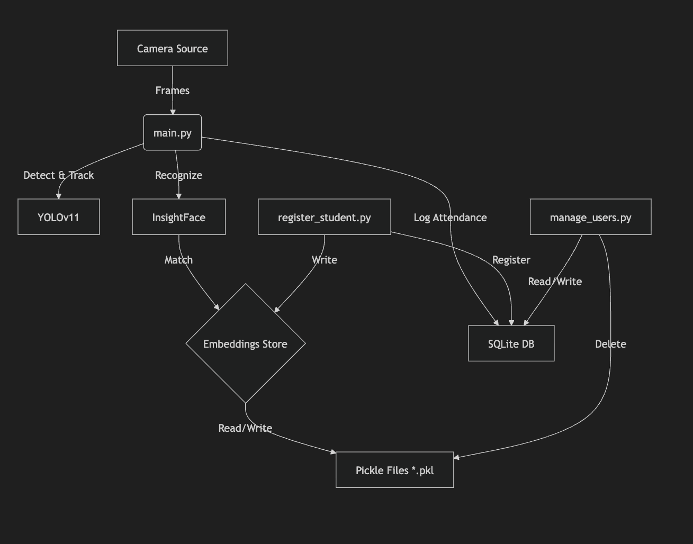

# Current System Analysis & Phase 2 Readiness

## 1. Project Overview
The `MOT-Attendance` project is a Python-based real-time biometric attendance system utilizing computer vision. It currently operates as a set of CLI/GUI scripts running locally.

**Core Components:**
- **Face Detection & Recognition**: `insightface` (Buffalo_L model) combined with `ultralytics` (YOLOv11n) for person tracking.
- **Tracking**: BotSort tracker (custom config).
- **Storage**: Hybrid approach using **SQLite** for relational data (sessions, logs) and **Pickle (.pkl)** files for high-dimensional face embeddings.

## 2. Key Files & Logic

### `main.py` (The Engine)
- **Function**: Handles the live video feed, detection, recognition, and attendance logging.
- **Flow**:
  1.  Loads embeddings from `data/embeddings/{section}.pkl`.
  2.  Starts a YOLO tracker + FaceAnalysis worker.
  3.  Manages a "Session" (e.g., Class period).
  4.  Updates `session_attendance` table in DB.
  5.  Implements complex logic for "Pulse", "Shadow Update" (adaptive learning), and "Green/Blue Tag" (UI feedback).
- **Web Integration Point**: This script controls the camera. For a web version, this logic might need to run as a backend service, streaming processed frames or data to a frontend.

### `core/db_manager.py` (The Data Layer)
- **Database**: SQLite (`data/attendance.db`).
- **Schema**:
  - `students`: Registry of ID, Name, Section.
  - `sessions`: Tracks active/closed class sessions.
  - `session_attendance`: Links students to sessions with status (Present/Absent).
  - `unknown_detections`: Logs intruders/unknown faces.
- **Web Integration Point**: The web backend (FastAPI/Flask/Django) will heavily rely on this class to query attendance history and manage students.

### `register_student.py` (Enrollment)
- **Function**: CLI wizard to capture 100 face frames and save a mean embedding.
- **Web Integration Point**: This needs to be reimagined for the web.
  - **Browser**: Capture images via webcam API.
  - **Server**: Receive images -> Generate Embedding -> Save to Pickle + DB.

### `manage_users.py` (Admin)
- **Function**: CRUD operations for students and sessions.
- **Web Integration Point**: These features (List, Delete, View Sessions) directly map to the "Admin Dashboard" of the web app.

## 3. Data Flow & Architecture

## 4. Phase 2 (Web) Recommendations

To move to a web-based architecture, we need to decide on the architecture:

### Option A: Local Web Interface (Streamlit/Gradio)
*   **Pros**: Easiest to implement. Keeps current Python scripts running as-is.
*   **Cons**: Limited UI customization. Not a "true" web app.

### Option B: Modern Web App (React/Next.js + FastAPI)
*   **Pros**: Professional UI, scalable, separation of concerns.
*   **Cons**: More complex. Needs a bridge between the CV loop and the web server.

**Recommended Steps:**
1.  **API Layer**: Create a FastAPI / Flask wrapper around `DBManager` to serve data.
2.  **Frontend**: Build a dashboard to view `attendance.db` data (Sessions, Students).
3.  **Real-time**:
    *   *Challenge*: Streaming `cv2.imshow` to a browser is non-trivial with high performance.
    *   *Solution*: MJPEG streaming or WebRTC integration for the active feed.

## 5. Areas for Improvement (Pre-Web)
- **Hardcoded Paths**: Paths like `data/embeddings` are scattered. Centralize configuration.
- **Concurrency**: `main.py` uses threads but file I/O (Pickle) might race with the web server if not careful.
- **Schema**: The dual storage (DB + Pickle) is fine for now but ensure the Web App knows how to handle the Pickle files if it needs to do registration.
