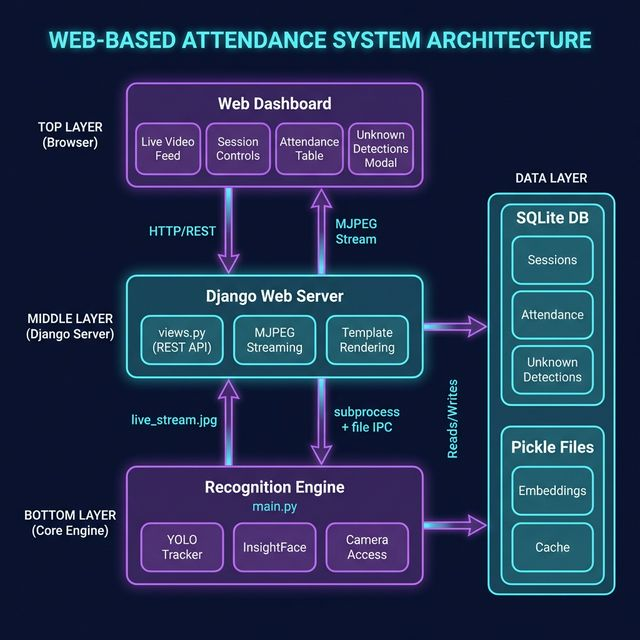

# Phase 2a: Web Dashboard - Live Session Management

**Duration**: Phase 1 → Phase 2a  
**Status**: ✅ Completed  
**Date**: February 8, 2026

---

## 1. Overview

Phase 2a transforms the CLI-based attendance system into a **web-accessible dashboard** for live session management. The core recognition engine (`main.py`) remains unchanged, while a Django web layer provides browser-based control and monitoring.

### Key Achievements
- ✅ Real-time MJPEG video streaming to browser
- ✅ Session start/stop/pause controls from web UI
- ✅ Live attendance table with IST timestamps
- ✅ Unknown detections modal with image previews
- ✅ Cache file preloading for faster startup
- ✅ Graceful error handling and connection recovery

---

## 2. Architecture



### Communication Flow
1. **Browser → Django**: HTTP/REST requests for session control
2. **Django → main.py**: Subprocess launch + file-based IPC (`commands.json`)
3. **main.py → Django**: Writes processed frames to `live_stream.jpg`
4. **Django → Browser**: Streams frames as MJPEG via `StreamingHttpResponse`

---

## 3. Files Created/Modified

### New Files
| File | Purpose |
|------|---------|
| `web_dashboard/` | Django project root |
| `web_dashboard/config/settings.py` | Django settings (IST timezone, media paths) |
| `web_dashboard/dashboard/views.py` | REST API endpoints + MJPEG streaming |
| `web_dashboard/dashboard/templates/dashboard/index.html` | Single-page dashboard UI |
| `web_dashboard/dashboard/urls.py` | URL routing |

### Modified Files
| File | Changes |
|------|---------|
| `main.py` | Added `--web` mode, file-based frame output, command polling |
| `core/db_manager.py` | Added IST timestamp for unknown detections |

---

## 4. Features Implemented

### 4.1 Session Management
- **Start Session Modal**: Section selection, session naming, cache preload, export toggle
- **19-second Countdown Loader**: Rotating status messages during AI model initialization
- **Pause/Resume**: Toggle recognition without stopping the session
- **Stop Session**: Graceful shutdown with cache export
- **Cancel During Loading**: Abort session start within countdown window

### 4.2 Live Video Feed
- **MJPEG Streaming**: Real-time video at ~15 FPS
- **Connection Recovery**: Auto-reconnect on stream errors
- **Error Modal**: User-friendly dialog for broken pipe/connection issues

### 4.3 Attendance Tracking
- **Live Table**: Name, Student ID, Last Seen (with seconds)
- **Present Count**: Real-time attendee counter
- **Attendance Rate**: Percentage calculation

### 4.4 Unknown Detections
- **Badge Counter**: Shows count of unknown faces
- **Modal View**: Click to see captured images with track IDs
- **IST Timestamps**: Corrected from UTC to local time

### 4.5 User Experience
- **Mobile Warning**: "Use tablet/laptop" message for screens < 900px
- **Dark Theme**: Modern glassmorphism UI
- **Tab Close Protection**: Beacon stops session on browser close

---

## 5. Technical Decisions

| Decision | Rationale |
|----------|-----------|
| **Django over FastAPI** | Template rendering + static files simplified deployment |
| **File-based IPC** | Simple, no WebSocket complexity; `commands.json` + `live_stream.jpg` |
| **MJPEG over WebRTC** | Browser-native, no additional libraries, acceptable latency |
| **19-second loader** | Accounts for AI model loading + camera warm-up |
| **SQLite default timestamps** | Overridden with explicit IST for unknown detections |

---

## 6. Known Limitations

- **Single User**: Only one session can run at a time
- **Local Camera Only**: Webcam must be attached to server machine
- **No Authentication**: Dashboard is open (for now)
- **File-based IPC**: Slight latency vs direct process communication

---

## 7. Upcoming Phases

### Phase 2b: MP4 Video Support
- Upload pre-recorded videos for processing
- Batch attendance from recorded lectures
- Progress indicator for video processing

### Phase 2c: Reports & Admin Dashboard
- Attendance reports (CSV/PDF export)
- Session history with filtering
- Student management from web UI
- `manage.py` functionalities via browser

### Phase 2d: External Camera Support
- IP camera (CCTV) integration
- Phone as webcam (DroidCam, etc.)
- Multi-camera selection dropdown
- RTSP stream support

---

## 8. Running the Dashboard

```bash
# Navigate to web dashboard
cd web_dashboard

# Run development server
python manage.py runserver

# Access at http://127.0.0.1:8000
```

---

## 9. Summary

Phase 2a successfully bridges the gap between the CLI-based recognition engine and a modern web interface. The dashboard provides:

- **Operator-friendly controls** for non-technical users
- **Real-time visibility** into attendance capture
- **Error resilience** for production use

The architecture is designed for extensibility, with clear separation between the recognition engine and web layer, enabling future phases to add features without disrupting core functionality.
