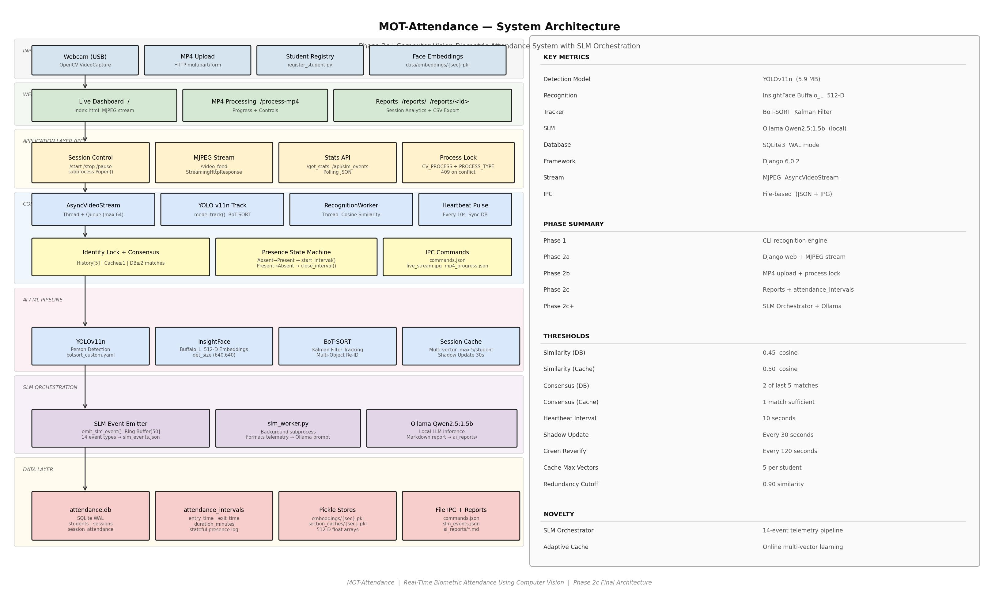

# Phase 2c: Reports, Analytics & SLM Orchestration

**Duration**: Phase 2b → Phase 2c
**Status**: ✅ Completed
**Date**: April 8, 2026

---

## 1. Overview

Phase 2c introduces two major capabilities: a stateful **attendance interval tracking system** with full session reporting, and an **SLM Orchestration pipeline** that provides real-time AI commentary and post-session report generation using a local small language model.

The database is migrated from a snapshot-only model to a fully stateful model by adding the `attendance_intervals` table, enabling per-student entry/exit tracking and precise time-in-room analytics.

### Key Achievements
- ✅ Stateful attendance tracking via `attendance_intervals` table
- ✅ Presence state machine (Absent ↔ Present transitions with interval logging)
- ✅ `/reports/` — filterable session history with attendance rates
- ✅ `/reports/<session_id>/` — per-student entry/exit/duration analytics
- ✅ CSV export of session attendance data
- ✅ SLM Event Emitter with 14 event types and a ring buffer (max 50 events)
- ✅ Real-time AI event commentary in the web dashboard
- ✅ Post-session report generation via `slm_worker.py` + Ollama Qwen2.5:1.5b
- ✅ Automatic section detection from available `.pkl` embeddings

---

## 2. Architecture



### Communication Flow

```
main.py (Core Engine)
  │
  ├─ Every 10s: Heartbeat Pulse
  │     ├─ DB: global_heartbeat_sync() — reset all → mark present
  │     └─ Interval State Machine:
  │           Absent→Present  →  db.start_interval()
  │           Present→Absent  →  db.close_interval() + duration
  │
  ├─ Per frame: emit_slm_event() → slm_events.json (ring buffer)
  │
  └─ Session End:
        ├─ Export section cache → data/section_caches/{sec}.pkl
        └─ Spawn: python slm_worker.py <events_file> <session_name>
                    └─ Ollama Qwen2.5:1.5b → ai_reports/*.md

Django (Web Layer)
  ├─ GET /reports/              → reports_index.html (session list)
  ├─ GET /reports/<id>/         → reports.html (detail analytics)
  ├─ GET /api/reports/          → JSON session list
  ├─ GET /api/reports/<id>/     → JSON analytics payload
  ├─ GET /api/slm_events/       → JSON ring buffer
  └─ GET /api/latest_report/    → Markdown AI report text
```

---

## 3. Database Changes

### New Table: `attendance_intervals`

```sql
CREATE TABLE attendance_intervals (
    id              INTEGER PRIMARY KEY AUTOINCREMENT,
    session_id      INTEGER,
    student_id      TEXT    NOT NULL,
    student_name    TEXT,
    entry_time      DATETIME NOT NULL,
    exit_time       DATETIME,               -- NULL while student is present
    duration_minutes REAL,                  -- Populated on exit
    FOREIGN KEY(session_id) REFERENCES sessions(id)
);
```

**Purpose**: Records every continuous presence window per student.
A student who enters, leaves, and re-enters produces two separate interval rows.

### Presence State Machine

```
Per-student state:  { is_present: bool,  active_interval_id: int | None }

Every 10-second Heartbeat:
  ┌─ Student in present_set AND is_present == False
  │     → db.start_interval()
  │     → Set is_present = True
  │     → Emit INTERVAL_START event
  │
  └─ Student NOT in present_set AND is_present == True
        → db.close_interval()  +  calculate duration_minutes
        → Set is_present = False
        → Emit INTERVAL_END event
```

---

## 4. Files Created / Modified

### New Files

| File | Purpose |
|------|---------|
| `slm_worker.py` | Background subprocess: reads telemetry, prompts Ollama, writes Markdown report |
| `web_dashboard/dashboard/templates/dashboard/reports_index.html` | Session list with filtering and search |
| `web_dashboard/dashboard/templates/dashboard/reports.html` | Per-student interval analytics and CSV export |
| `assets/Architecture_Final.jpg` | Final system architecture diagram |
| `assets/Flowchart_Final.jpg` | Complete system flowchart |
| `Phases_Journey/Phase2c.md` | This document |

### Modified Files

| File | Changes |
|------|---------|
| `core/db_manager.py` | Added `attendance_intervals` table, `start_interval()`, `close_interval()`, `get_session_intervals()` |
| `main.py` | Added `student_presence_state` dict, interval state machine in heartbeat, `emit_slm_event()`, SLM event types, spawn of `slm_worker.py` on session end |
| `web_dashboard/dashboard/views.py` | Added `/reports/`, `/reports/<id>/`, `/api/reports/`, `/api/reports/<id>/`, `/api/slm_events/`, `/api/latest_report/` routes |
| `web_dashboard/config/urls.py` | Registered new report and SLM API routes |
| `web_dashboard/dashboard/templates/dashboard/index.html` | Added SLM Orchestrator event drawer, Report drawer (Markdown renderer), AI event polling (3s), section auto-detection from embeddings |

---

## 5. Features Implemented

### 5.1 Attendance Interval Tracking

- Every student transition (enters frame → leaves frame) creates a row in `attendance_intervals`.
- `duration_minutes` is computed on close: `(exit_time - entry_time).total_seconds() / 60`.
- Enables queries such as:
  - *How long was each student present?*
  - *Did any student bunk mid-session?*
  - *What was the first entry / last exit time?*

### 5.2 Reports Page (`/reports/`)

- Lists all completed sessions with section, date, duration, and attendance rate.
- Filterable by section via dropdown.
- Searchable by session name.
- Each row links to the session detail page.

### 5.3 Session Detail Report (`/reports/<session_id>/`)

- **Metadata**: Session name, section, start/end time (IST), total duration.
- **Per-Student Table**: Entry time, exit time, total time present, bunk intervals.
- **Summary Statistics**: Attendance rate %, present count, absent count.
- **CSV Export**: Downloads per-student attendance data.

### 5.4 SLM Event Emitter

A lightweight telemetry system embedded in `main.py` that emits structured events to `data/slm_events.json` throughout a session:

| Event Type | Trigger |
|------------|---------|
| `SESSION_INIT` | Session started |
| `CACHE_LOADED` | Section cache preloaded |
| `NEW_TRACK` | New person detected by YOLO |
| `IDENTITY_LOCKED` | Consensus reached, face recognized |
| `CONSENSUS_BUILDING` | Accumulating recognition matches |
| `CACHE_UPDATED` | Multi-vector cache expanded |
| `CACHE_SKIPPED` | Redundant embedding rejected |
| `INTERVAL_START` | Student entered (presence window opened) |
| `INTERVAL_END` | Student exited (presence window closed) |
| `HEARTBEAT` | 10-second DB sync fired |
| `UNKNOWN_DETECTED` | Unrecognized visitor logged |
| `FACE_QUALITY_LOW` | Face crop rejected (size or det_score) |
| `SHADOW_UPDATE` | Adaptive cache refinement triggered |
| `SESSION_CLOSED` | Session terminating |

Events are stored as a ring buffer (max 50 entries). The dashboard polls `/api/slm_events/` every 3 seconds and renders human-readable commentary in the **AI Orchestrator Drawer**.

### 5.5 Post-Session SLM Report (`slm_worker.py`)

On session end, `main.py` spawns `slm_worker.py` as a background subprocess:

1. Reads the full `slm_events.json` telemetry log.
2. Formats it as a structured text prompt.
3. Sends to **Ollama Qwen2.5:1.5b** (local, no network required) with a system prompt instructing it to produce a professional attendance summary.
4. Writes the Markdown output to `data/ai_reports/ai_report_{session}_{timestamp}.md`.
5. The dashboard polls `/api/latest_report/` and renders the report in the **Report Drawer** using `marked.js`.

**System Prompt (summary)**:
> You are the AI Orchestrator for an advanced computer vision attendance system. Review the telemetry log and write a concise, professional summary including: overall attendance, notable timeline events, and system learning observations.

### 5.6 Auto Section Detection

The Start Session modal now auto-populates the section dropdown by scanning `data/embeddings/*.pkl`, eliminating manual section entry errors.

---

## 6. Technical Decisions

| Decision | Rationale |
|----------|-----------|
| **attendance_intervals over snapshot-only** | Snapshot DB cannot answer time-in-room queries; intervals make duration and bunk detection trivial |
| **Heartbeat as state machine trigger** | 10s granularity prevents single-frame occlusion from marking a student absent |
| **File-based event log (slm_events.json)** | Zero-dependency IPC; readable by both main.py and Django without shared memory |
| **Background subprocess for SLM** | Ollama inference is slow (~5–15s); running it in a subprocess avoids blocking session cleanup |
| **Qwen2.5:1.5b** | Smallest Qwen model that produces coherent paragraphs; runs on CPU without GPU |
| **Ring buffer (max 50 events)** | Prevents unbounded file growth during long sessions |
| **marked.js for report rendering** | Markdown-to-HTML in browser; no server-side template rendering required |

---

## 7. Known Limitations

- **Ollama dependency**: Post-session report requires Ollama daemon running locally. Report silently skipped if unavailable.
- **10-second granularity**: Students absent for less than 10 seconds are not marked absent (by design — prevents flicker).
- **Single-camera**: All intervals are from one video source.
- **No authentication**: Reports are publicly accessible on the LAN.

---

## 8. Upcoming Work

### Phase 2d: External Camera Support (Planned)
- IP camera / CCTV via RTSP stream
- Phone-as-webcam (DroidCam integration)
- Multi-camera source selection dropdown

### Phase 2e: Student & Admin Management (Planned)
- `manage_users.py` functionality via web UI
- Role-based access (faculty login)
- Student enrollment from browser (register_student.py equivalent)

---

## 9. Running the Full System

```bash
# Start Ollama (required for post-session AI report)
ollama serve
ollama pull qwen2.5:1.5b

# Start Django web dashboard
cd web_dashboard
python manage.py runserver
# Access: http://127.0.0.1:8000

# Reports available at:
# http://127.0.0.1:8000/reports/
# http://127.0.0.1:8000/reports/<session_id>/
```

---

## 10. Summary

Phase 2c completes the data pipeline by adding true stateful attendance tracking and the first AI-generated reporting capability. The system now captures not just *who was present* but *when, for how long, and what the recognition engine observed* throughout the session.

The SLM Orchestration layer gives operators real-time insight into system behavior without requiring them to read logs, and produces a permanent, human-readable session narrative stored alongside the structured database records.

| Capability | Phase 2b | Phase 2c |
|------------|----------|----------|
| Present / Absent snapshot | ✅ | ✅ |
| Time-in-room per student | ✗ | ✅ |
| Entry / exit timestamps | ✗ | ✅ |
| Bunk interval detection | ✗ | ✅ |
| Session history page | ✗ | ✅ |
| CSV export | ✗ | ✅ |
| Real-time AI event stream | ✗ | ✅ |
| Post-session LLM report | ✗ | ✅ |
| Auto section detection | ✗ | ✅ |
